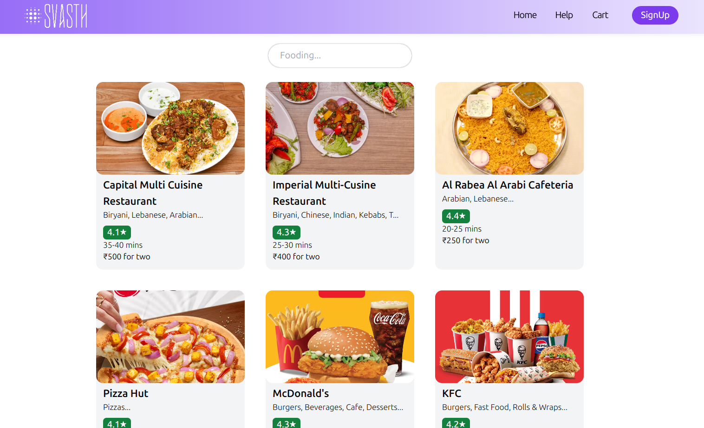
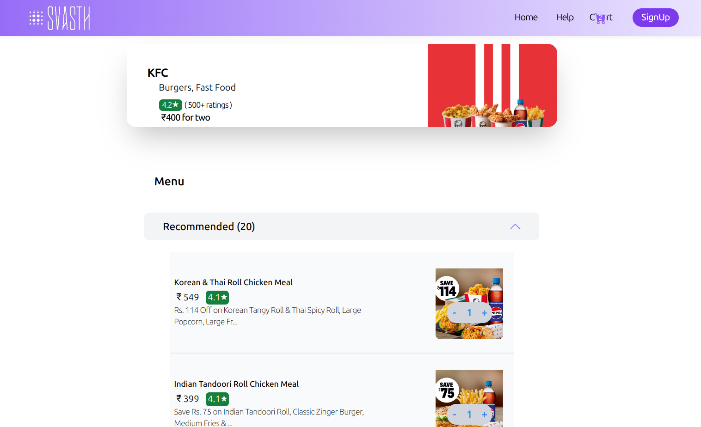
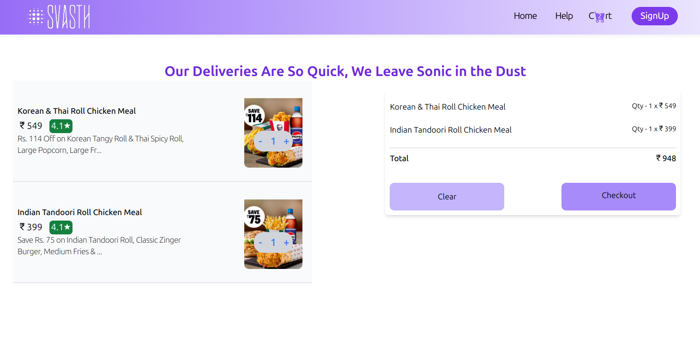

# Food Ordering Website

## Introduction
This is a React-based web application for ordering food online. The application lists restaurants and their menu items using a third-party API. Users can browse restaurants, view their menus, and place orders.

## Features
- List of restaurants
- Detailed menu for each restaurant
- User authentication and authorization
- Order placement and tracking

- **Browse Restaurants:** View the list of available restaurants.

  

- **View Menu:** Click on a restaurant to see the menu items it offers.

  
- **Place Order:** Add items to your cart and proceed to checkout.
 
  

## Technologies Used
- **Frontend:** React, Redux, Tailwind CSS
- **API Integration:** Third-party API for restaurant and menu data

## Prerequisites
- Node.js
- npm or yarn
- A third-party API key (for restaurant and menu data)

## Install Dependencies

npm install
or
yarn install

## Start the Development Server

npm start
or
yarn start
